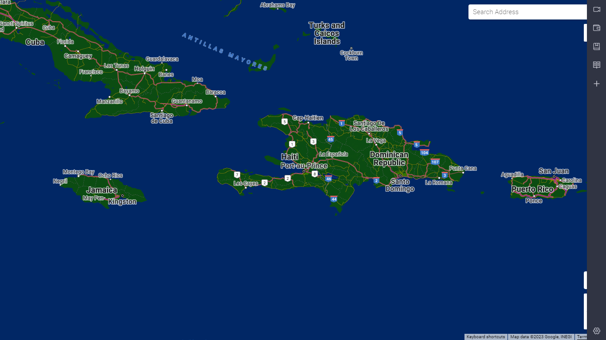

# CustomGoogleMapTheme

**CustomGoogleMapTheme** is a web page that shows a custom made google map. In that map you can change the color, look, places to fit the way you want it to be. For the changes the be effective, you'll need to do it on the Google map platform to style the map.  

## Demo

## Open-source libraries used

- [Google map platform](https://console.cloud.google.com/google/maps-apis/home?project=regal-reporter-390119)

## How to test

- A navigator(Google chrome, Firefox, Brave...)
- Open the index.html file
